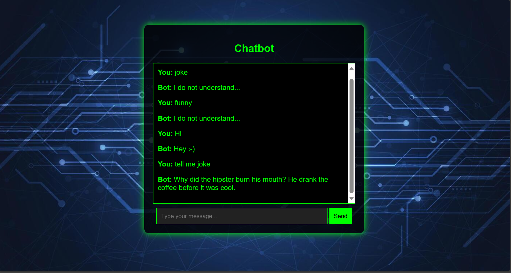

# AI-Powered Chatbot with Web Deployment


## Chatbot UI Preview 🖥️




## Overview
This project is a **contextual AI chatbot** built using **PyTorch, NLTK, and Flask**. 
It supports both **command-line interaction** and a **web-based interface**. 
The chatbot is trained on a customizable `intents.json` dataset and can be deployed on an **AWS EC2 instance** for online access.

## Features
- **AI-based Chatbot** using PyTorch
- **Customizable Intent Recognition** with NLTK
- **Web Interface** powered by Flask
- **Cloud Deployment** on AWS EC2
- **Easy Setup & Training** with `train.py`

## Installation & Setup
### Prerequisites
- Python 3.8 or later
- pip (Python package manager)
- Git (for version control)

### Setup Instructions
1. **Clone the repository**
   ```bash
   git clone https://github.com/YOUR_USERNAME/chatbot-project.git
   cd chatbot-project
   ```
2. **Install dependencies**
   ```bash
   pip install -r requirements.txt
   ```
3. **Train the chatbot model**
   ```bash
   python train.py
   ```
4. **Run the chatbot**
   - **Command-line mode:**
     ```bash
     python chat.py
     ```
   - **Web-based mode:**
     ```bash
     python app.py
     ```
     Open a browser and go to `http://127.0.0.1:5000`

## Deployment on AWS EC2
1. **Launch an EC2 Instance** (Ubuntu 22.04 recommended)
2. **Connect via SSH**
   ```bash
   ssh -i path/to/your-key.pem ubuntu@your-ec2-public-ip
   ```
3. **Install dependencies on EC2**
   ```bash
   sudo apt update && sudo apt install python3-pip git -y
   ```
4. **Clone the repository & set up the chatbot**
   ```bash
   git clone https://github.com/YOUR_USERNAME/chatbot-project.git
   cd chatbot-project
   pip install -r requirements.txt
   python app.py
   ```
5. **Access the chatbot** via `http://your-ec2-public-ip:5000`

## License
This project is open-source and licensed under the MIT License.

## Author
Developed by **Rohit Raut**. Feel free to contribute and improve!
